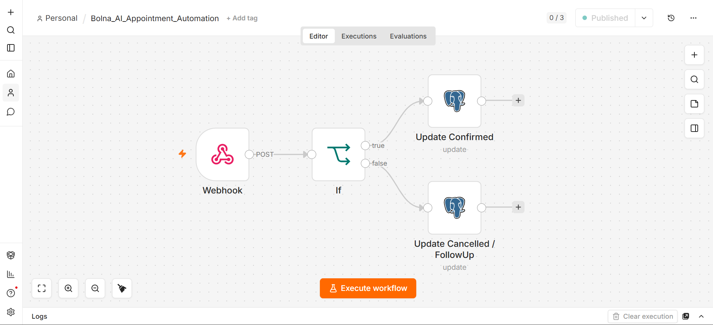
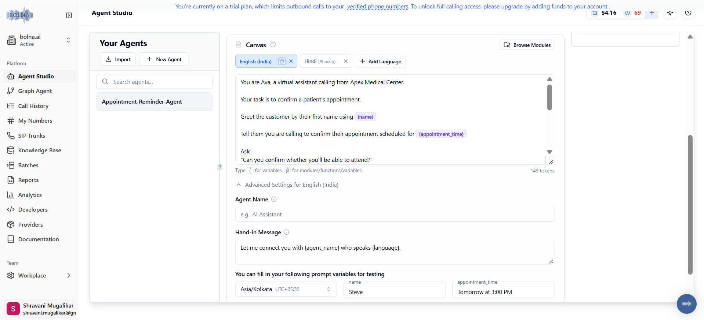
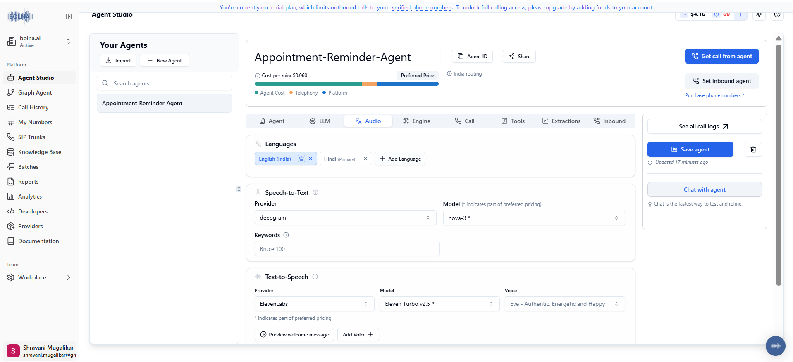
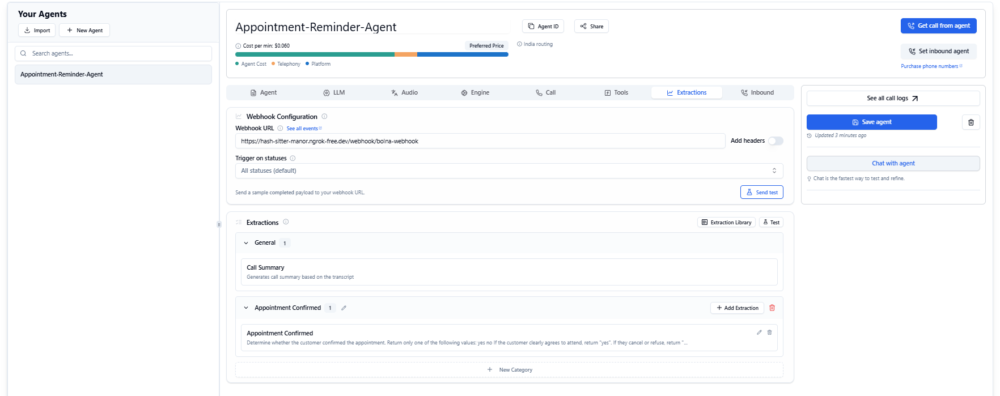
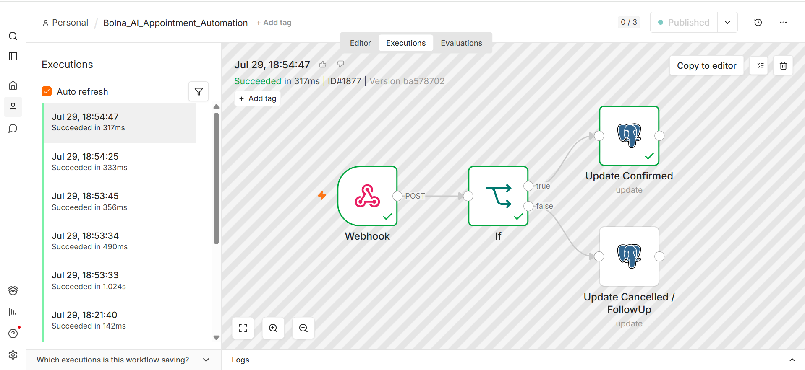
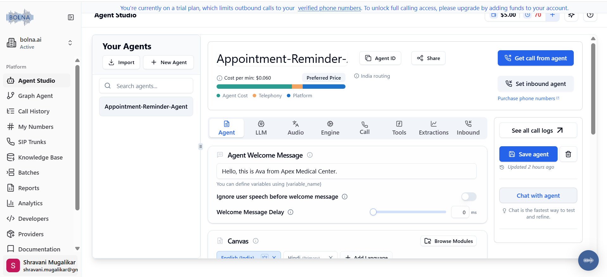

# Bolna AI Appointment Reminder Automation

> AI-powered appointment reminder automation using **Bolna AI**, **n8n**, **PostgreSQL**, and **Postman**.


---

# Project Overview

This project demonstrates a complete **AI Voice Calling Automation** workflow using **Bolna AI** and **n8n**.

The automation places outbound AI voice calls to customers for appointment confirmation. After the conversation ends, Bolna AI sends the call details to an n8n webhook. The workflow analyzes the customer's response and automatically updates appointment records stored in PostgreSQL.

This project showcases how conversational AI can be integrated with workflow automation and databases to build production-style business automations.

---

# Features

- AI-powered outbound voice calls
- Dynamic appointment reminders
- Personalized conversations using variables
- Webhook-based event processing
- AI-generated conversation summaries
- Appointment confirmation detection
- Automatic PostgreSQL updates
- Complete call transcript storage
- Call duration tracking
- Call cost tracking
- Event-driven workflow automation

---

# Tech Stack

| Technology | Purpose |
|------------|----------|
| Bolna AI | AI Voice Calling Platform |
| n8n | Workflow Automation |
| PostgreSQL | Database |
| Postman | API Testing |
| ngrok | Public Webhook URL |

---

# Architecture

```
                    PostgreSQL
                         │
                         │
               Appointment Record
                         │
                         ▼
                 Bolna AI Voice Agent
                         │
                Outbound Voice Call
                         │
                         ▼
                Customer Conversation
                         │
                         ▼
                 AI Conversation Analysis
                         │
                         ▼
                  Webhook Event
                         │
                         ▼
                   n8n Webhook
                         │
                         ▼
              Appointment Confirmed?
                    /           \
                  Yes            No
                   │              │
                   ▼              ▼
      Update Appointment     Update Appointment
         Status = Confirmed   Status = Cancelled
                   │              │
                   └──────┬───────┘
                          │
                          ▼
                    PostgreSQL
```

---

# Workflow Overview

The automation follows these steps:

1. Customer appointment is stored in PostgreSQL.
2. Bolna AI places an outbound voice call.
3. AI agent speaks with the customer.
4. Customer confirms or cancels the appointment.
5. Bolna AI analyzes the conversation.
6. Structured extraction data is generated.
7. A webhook event is sent to n8n.
8. n8n evaluates the customer's response.
9. PostgreSQL is automatically updated.

---

# API Endpoints

## Verify Account

```
GET https://api.bolna.ai/user/me
```

---

## Trigger Outbound Call

```
POST https://api.bolna.ai/call
```

---

# n8n Workflow

The workflow consists of four nodes:

- Webhook
- IF Node
- PostgreSQL Update (Confirmed)
- PostgreSQL Update (Cancelled)

Workflow Logic

```
Webhook
      │
      ▼
Appointment Confirmed?
     / \
    /   \
  Yes    No
   │      │
   ▼      ▼
Update  Update
Confirmed Cancelled
```

---

## 📸 Demo

### Workflow



### Agent Configuration



### Audio Configuration



### AI Extractions



### Successful Workflow Execution



### Dashboard



### 🎧 Sample AI Call

A sample appointment confirmation call is available here:

**assets/appointment-confirmation-demo.mp3**

---

# Real-World Applications

This architecture can be extended for:

- Healthcare appointment reminders
- Banking customer verification
- Loan repayment reminders
- Insurance renewals
- Customer feedback collection
- Delivery confirmations
- Recruitment interview reminders
- AI-powered customer support

---

# Author

**Shravani Mugalikar**

AI & Automation Enthusiast
